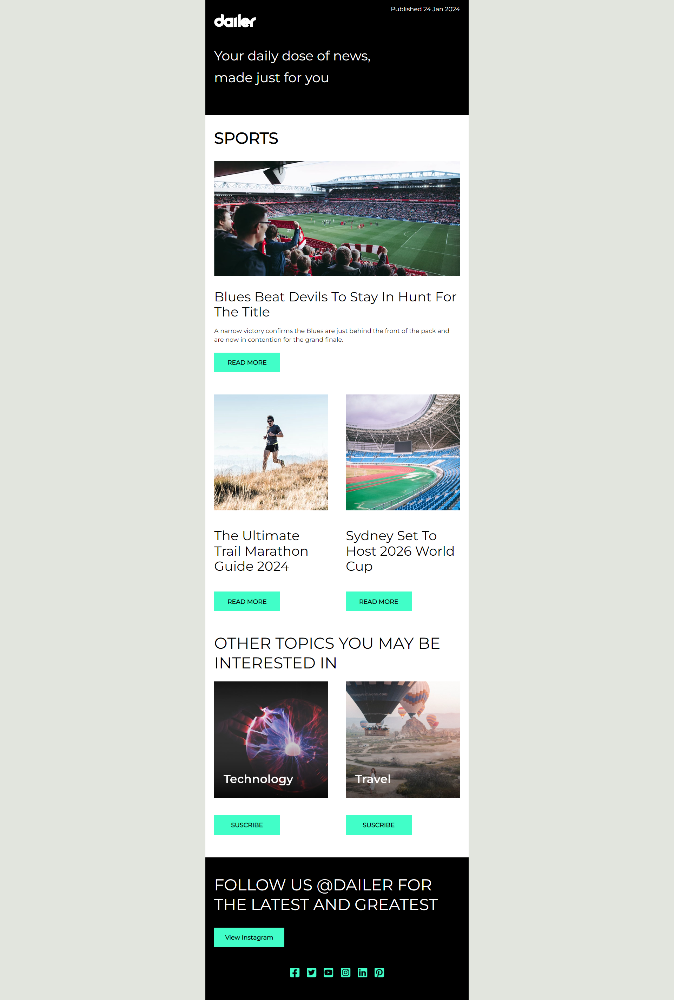

# Newsletter Email

This is a solution to an email template on [Campaign Monitor](https://www.campaignmonitor.com/email-templates/). 
Campaign Monitor is a website that hosts free email templates. 

## Table of contents
- [Overview](#overview)
  - [Screenshot](#screenshot)
  - [Links](#links)
- [My process](#my-process)
  - [Built with](#built-with)
  - [What I learned](#what-i-learned)
  - [Continued development](#continued-development)
  - [Useful resources](#useful-resources)

## Overview

### Screenshot

### Links

- [GitHub Repo URL](https://github.com/adrvnc/newsletter_email)
- [Live Site URL](https://adrvnc.github.io/newsletter_email/)

## My Process

### Built with 

- MJML 

### What I learned 

I used this project as an opportunity to learn how to make responsive
emails with the MJML framework. 

### Continued development

I see MJML as a tool that I can use to build 
complex emails. In future projects, I plan on using it for that 
specific reason to streamline my work. 

### Useful resources

- [MJMLM YouTube Channel](https://www.youtube.com/channel/UC465d1Nv-XMqYsnxIjmQjQQ/videos)- Owned by Tobias, a web designer. This channel is helpful for anyone who wants to learn the basics of MJML. 
